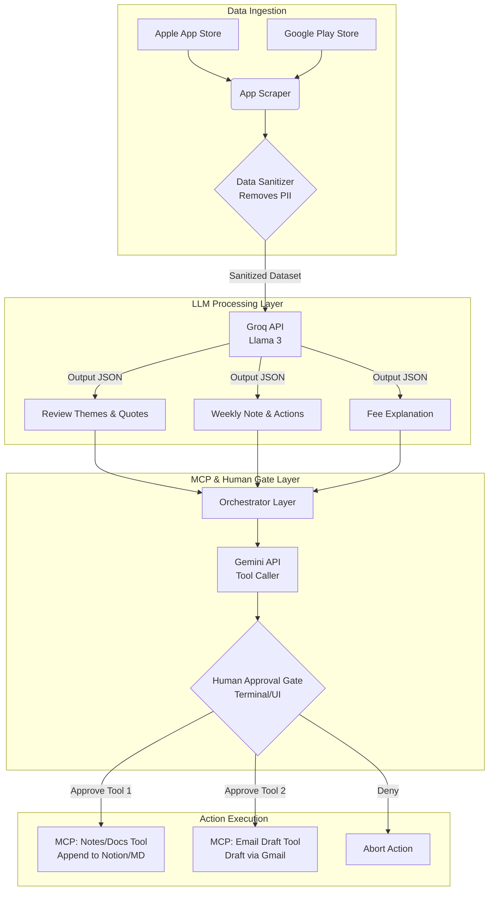

# Architecture Plan: INDmoney AI Review Workflow & Weekly Pulse

This document outlines the phase-wise architecture for building an AI workflow that processes INDmoney app reviews into a weekly product pulse and generates structured explanations, using Groq and Gemini as the LLMs and MCP (Model Context Protocol) for external actions.

## System Components
1.  **Data Ingestion Module**: Reads and sanitizes input CSV files.
2.  **LLM Processing Engine (Groq)**: Analyzes themes, extracts quotes, and generates content.
3.  **MCP Integration Layer (Gemini)**: Uses Gemini to connect to external tools (Notes/Docs, Email) with approval gates.
4.  **Orchestrator Script**: Ties the modules together and manages the human-in-the-loop workflow.

## Flow & Architecture Diagram

## Required Libraries & Tech Stack

The following python libraries and tools will be utilized to implement this architecture:

*   **Data Scraping & Handling**:
    *   `google-play-scraper`: To extract reviews from the Android Play Store.
    *   `app-store-scraper`: To extract reviews from the iOS App Store.
    *   `pandas`: For data manipulation, filtering by dates (8-12 weeks), and handling CSV structures.
*   **AI Models**:
    *   `groq`: The Groq Python SDK for lightning-fast inference (Llama models) to perform the heavy lifting of summarization and theme extraction.
    *   `google-genai` (or `google-generativeai`): For interacting with Gemini to perform the tool-calling/routing logic to MCP.
    *   `python-dotenv`: Uniquely for securely managing API keys (`GROQ_API_KEY`, `GEMINI_API_KEY`, etc.).
*   **MCP Protocol**:
    *   `mcp`: Standard Model Context Protocol python SDK to create and interact with our tools.
    *   Integration specific libraries (e.g. `google-api-python-client` if using Gmail API, or Notion SDK if choosing Notion for docs).

---

## Phase 1: Setup & Data Ingestion
**Goal:** Prepare the environment, extract raw review data, and output a sanitized dataset securely.
**Input:** App Store unique identifiers (e.g., `com.indwealth.rn` for Google Play Store).
**Expected Output:** A sanitized `pandas` DataFrame or CSV containing only relevant review fields (Text, Rating, Date).
**Validation Engine:** 
* Scrape exactly 3,000 reviews while ensuring equal representation across 1 to 5-star ratings and forcing sorting by 'MOST_RELEVANT' parameters to capture deeply helpful content.
* RegEx/NLP scan verifying PII elements (emails, phone numbers, localized names) are successfully masked before saving.
* **Emoji Removal:** All emojis and graphical characters must be aggressively stripped from the raw text to ensure cleaner LLM tokenization.
*   **Length Quality Check:** Discard any review containing fewer than 5 words, removing trivial non-actionable reviews (e.g. "Good app").
*   **Deduplication:** Remove exact match duplicate reviews based on text content to preserve context width for distinct feedback.

*   **1.1 Environment Setup**: 
    *   Initialize Python project.
    *   Install dependencies (`pandas` for data processing, `google-play-scraper` and `app-store-scraper` (or similar) for extracting reviews, `groq` SDK, `google-genai` SDK (for Gemini), relevant MCP SDKs/clients).
    *   Set up environment variables securely (Groq API Key, Gemini API Key, MCP tool credentials).
*   **1.2 Data Loading (App Review Scraping)**:
    *   Use scrapers to extract recent INDmoney reviews directly from the **Google Play Store** and the **Apple App Store**.
    *   Fetch the last 8–12 weeks of historical public reviews.
    *   Consolidate these into a structured DataFrame/CSV covering relevant columns (e.g., Review Text, Date, Rating, Source).
*   **1.3 Data Sanitization (PII Removal)**:
    *   Implement a pre-processing step to scrub potential Personally Identifiable Information (PII) like names, phone numbers, or emails from the review text before it ever reaches the LLM.

## Phase 2: LLM Processing (Groq API Integration)
**Goal:** Use Groq's fast inference to analyze the sanitized reviews and generate required structured artifacts.
**Input:** Stringified JSON or parsed CSV text of the sanitized INDmoney reviews. *Constraint: The script will dynamically sample the dataset so that the payload sent to the LLM never exceeds 12,000 tokens (approx. 9,000 words).*
**Prompt Strategy:**
*   **System Prompt:** "You are an expert INDmoney Product Manager. Analyze the provided user reviews and extract key insights. Do not hallucinate features."
*   **User Prompt:** "Process these reviews. Output a strict JSON object containing: 'themes' (max 5), 'top_3_themes', 'quotes' (exactly 3, real), 'weekly_note' (strict max 250 words), and 'action_ideas' (exactly 3)."
**Model Output Validation:** 
* JSON parsing success.
* Word count verification on `weekly_note` (throws error & retries if > 250 words).
* Length checks on `quotes` array and `action_ideas` array (must == 3).

*   **2.1 Review Analysis Prompt Engine**:
    *   Construct the runtime prompt by injecting the sanitized data into the predefined Prompt Strategy.
*   **2.2 Structured Explanation Generation**:
    *   Construct a separate prompt to generate a structured, standard explanation for one common fee/charge scenario specific to INDmoney (e.g., US stocks withdrawal fees, or mutual fund charges).

## Phase 3: MCP Tool Integration & Approval Gates (using Gemini)
**Goal:** Use Gemini's tool-calling capabilities to orchestrate external actions securely, enforcing manual human oversight.
**Input:** The validated, structured JSON produced by Phase 2 (Groq).
**Prompt Strategy:** "You are an orchestration AI. You have access to a 'Document_Appender' tool and an 'Email_Drafter' tool. Use the provided Weekly Pulse JSON to prepare payloads for both tools."
**Gate & Output Validation:** 
* The system intercepts the `function_call` request from Gemini.
* Validates that the tool payload matches the MCP schema.
* **HALTS EXECUTION**. Presents the exact tool arguments to the human via Terminal/UI. If human inputs 'Y', proceed to MCP. If 'N', abort.

*   **3.1 Tool 1: Append to Notes/Doc**:
    *   Configure an MCP server/tool that interfaces with a documentation system (e.g., appending to a local Markdown file, Notion, or Google Docs).
    *   This tool will receive the "Weekly Note", "Themes", "Quotes", and "Action Ideas".
*   **3.2 Tool 2: Create Email Draft**:
    *   Configure an MCP tool that generates an email draft via an email provider (e.g., Gmail API, local mail client integration).
    *   The tool payload will be formatted for team wide distribution.
*   **3.3 Approval Gating Mechanism**:
    *   Implement an interactive terminal prompt or lightweight UI that displays the LLM's proposed tool calls and arguments.
    *   The system *must* pause execution and wait for human confirmation (`Y/N`) before actually executing the MCP tools.

## Phase 4: Workflow Orchestration & Testing
**Goal:** Combine all phases into a cohesive, runnable script simulating the end-to-end Support/Product AI workflow.
**Validation Checkpoints:** End-to-end execution flow strictly obeys human gate locks. The final drafted email and appended document must precisely match Phase 2's generated structure.

*   **4.1 Main Execution Loop**:
    1.  Read and sanitize CSV.
    2.  Send data to Groq; receive parsed Pulse Data.
    3.  Generate the Fee/Charge Scenario explanation.
    4.  Display outputs to the user in the console.
    5.  Request approval to append to Notes/Docs. If yes, execute MCP Tool 1.
    6.  Request approval to draft the email. If yes, execute MCP Tool 2.
*   **4.2 Testing & Validation**:
    *   Test with sample dummy CSV data.
    *   Ensure the word count constraint (≤250 words) is consistently met.
    *   Verify the approval gates block execution when denied.

## Phase 5: Email Automation & UI Dashboard
**Goal:** Transmit the finalized email draft to stakeholders automatically and build a visual dashboard (Streamlit) for manual testing.
**Input:** `email_draft.txt` and `weekly_pulse_notes.md` from Phase 3.
**Execution Engine:** Python `smtplib` and Streamlit.
*   **5.1 SMTP Transmission**: 
    * Set up `email_sender.py` utilizing Gmail SMTP protocol to parse the drafted local text files.
    * Use environment variables (`EMAIL_SENDER` and `EMAIL_PASSWORD`) for security and authenticate securely using App Passwords.
*   **5.2 UI Testing Dashboard (Streamlit)**:
    * Build `app.py` leveraging Streamlit to give product managers a visual view of the exported data.
    * Provide a seamless text-input mechanism on the UI for manual triggering the SMTP email without needing to wait for a full week.
*   **5.3 CRON Scheduling & Automation (Completed Native Crontab)**:
    * The orchestrator bypass mechanism (`Y\nY\n` via printf) acts as the CLI bypass tool inside `run_weekly.sh`.
    * A native cron job is configured directly on the root user system (`0 10 * * 6`) to automatically trigger the `run_weekly.sh` script to target the pre-configured email `manish98ad@gmail.com` exactly at Saturday 10:00 AM IST.

## Phase 6: Public Subscription Web App (Frontend & Backend)
**Goal:** Expose the finalized weekly pulse generator to public users or internal product managers via a dedicated, beautiful web interface, allowing them to instantly receive a personalized copy of the email on-demand.
**Input:** User `Name` and `Email` provided via the Web UI.
**Execution Engine:** FastAPI (Backend) and HTML/CSS/JS (Frontend).
*   **6.1 API Backend Setup**: 
    * Spin up an async FastAPI application (`Phase6_Web_App/backend/app.py`).
    * Implement a `/api/subscribe` POST endpoint receiving `SubscriberInfo` schema.
    * The backend hooks into `Phase5_Email_UI/email_sender.py`, pushing the `target_email` and dynamically utilizing the `recipient_name` to insert a custom greeting inside the generated HTML email.
*   **6.2 Premium Frontend Application (`Phase6_Web_App/frontend/index.html`)**:
    * Visually stunning, responsive glassmorphism-styled frontend using pure Vanilla CSS.
    * Contains dynamic animated abstract blobs and a polished frosted glass subscription card.
    * Uses asynchronous `fetch` calls to subscribe and present immediate UI success feedback to the user.

---
## Project Delta Highlights (Recent Upgrades)
During development, several premium features were strategically added outside the core LLM scope to greatly enhance UI/UX and system automation:
1. **Dynamic HTML Poster Emails (Phase 5):** The system no longer just sends plain text. It dynamically parses LLM JSON outputs into a stunning minimalist email featuring sleek typography, grid layouts, horizontal 1px separators, and circular visual avatars representing review users.
2. **HD Poster Generator (`generate_poster.py`):** An independent script that natively renders the email format directly into an `HD_Poster.html` for out-of-browser rendering or PDF printing.
3. **Streamlit Sub-system Update:** The raw Streamlit debug dashboard was retrofitted with an `HD Poster Preview` tab utilizing `streamlit.components` to natively view the custom Email payload styles directly inside the analytics UI before sending.
4. **CLI Non-Interactive Loop:** Developed `run_weekly.sh` which forces human approval gates through `printf` pipes, granting autonomous scheduling power while maintaining manual control capabilities upon script direct execution.
